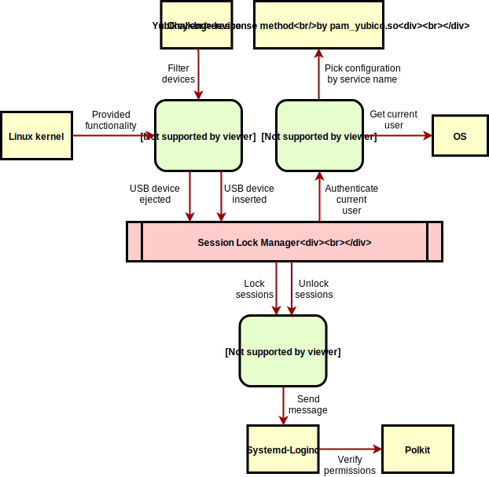

# session-lock-manager

This code provides you with a session lock manager for Linux desktop environments.

## Features

The session lock manager acts as a service running in the background and listening to USB security token
is inserted and rejected events. It does lock the current user session when the device is ejected and unlock
when it is inserted again.

## Supported hardware

  - all Yubikey having an USB interface (with challenge-response configured slot)

## Development

### Building the application

    go build github.com/elvetemedve/session-lock-manager

### Running tests

    go test -v github.com/elvetemedve/session-lock-manager/device
    go test -v github.com/elvetemedve/session-lock-manager/authentication

### Running the application

    go run github.com/elvetemedve/session-lock-manager <service-name>

    where service name is the appropriate filename in the pam.d directory

### Architecture

## Configuration

### Yubikey

Create a file like `/etc/pam.d/session-locker` with the content below:

    auth		required	pam_yubico.so mode=challenge-response
Now use the Yubikey configuration tool to setup a slot for challenge-response authentication without user presence.

### Polkit

If your Linux desktop has Polkit installed to control system-wide privileges, then you need to configure it to allow locking/unlocking the session as regular user,
because the session lock manager should not to be run as root. The simplest way to achieve this is to add your user into a new group who is trusted to lock/unlock session.
The following example assumes that the user is added to the **wheel** group.

Create the file `/etc/polkit-1/rules.d/49-sesson-lock-manager.rules` with the content below:

    /* Allow members of the wheel group to execute the defined actions
     * without password authentication, similar to "sudo NOPASSWD:"
     */
    polkit.addRule(function(action, subject) {
        if (action.id == "org.freedesktop.login1.lock-sessions" &&
            subject.isInGroup("wheel"))
        {
            return polkit.Result.YES;
        }
    });
