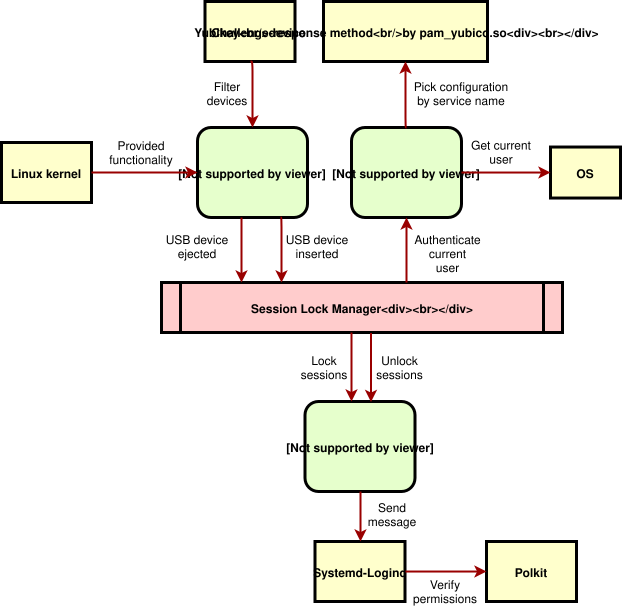

# session-lock-manager

This code provides you with a session lock manager for Linux desktop environments.

## Features

The session lock manager runs as a background service and listens for USB security token
insertion and removal events. It locks the current user session when the token is removed and unlocks it
when the token is inserted again and the user is authenticated with it.

## Supported hardware

  - any YubiKey with a USB interface and a slot configured for challenge-response

## Development

### Prerequisites

  - Go 1.22 or newer
  - a C compiler and `pkg-config` (the PAM and udev bindings use cgo)
  - PAM and libudev development headers, e.g. `libpam0g-dev libudev-dev` on Debian/Ubuntu
    or `pam-devel systemd-devel` on Fedora

### Building the application

    go build .

### Running tests

    go test ./...

### Running the application

    go run . <service-name>

where `<service-name>` is the name of the appropriate file in the `/etc/pam.d` directory
(see [Yubikey](#yubikey) below).

### Architecture

## Configuration

### Yubikey

Create a file like `/etc/pam.d/session-locker` with the content below:

    auth		required	pam_yubico.so mode=challenge-response

Now use the YubiKey configuration tool to set up a slot for challenge-response authentication without user presence.

### Polkit

If your Linux desktop has Polkit installed to control system-wide privileges, then you need to configure it to allow locking/unlocking the session as a regular user,
because the session lock manager should not be run as root. The simplest way to achieve this is to add your user to a group that is trusted to lock/unlock sessions.
The following example assumes that the user is added to the **wheel** group.

Create the file `/etc/polkit-1/rules.d/49-session-lock-manager.rules` with the content below:

    /* Allow members of the wheel group to execute the defined actions
     * without password authentication, similar to "sudo NOPASSWD:"
     */
    polkit.addRule(function(action, subject) {
        if (action.id == "org.freedesktop.login1.lock-sessions" &&
            subject.isInGroup("wheel"))
        {
            return polkit.Result.YES;
        }
    });
